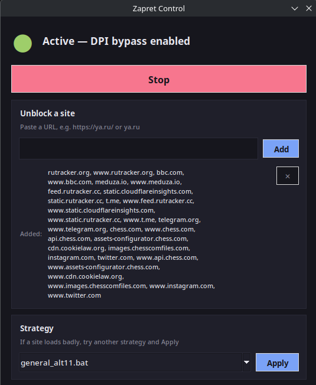

# Zapret Linux GUI

Обход блокировок сайтов (DPI) для Linux с графическим интерфейсом. Вся настройка происходит автоматически.



## Установка

**Вариант 1 — из Release (рекомендуется):**

1. Откройте [Releases](https://github.com/finestcrtn/zapret-linux-gui/releases)
2. Скачайте **`zapret-gui.flatpak`** — файл сохранится в папку «Загрузки»
3. Установите:

   ```sh
   flatpak install --user ~/Downloads/zapret-gui.flatpak
   ```

4. Запустите **Zapret Control** из меню приложений или командой:

   ```sh
   flatpak run io.github.zapretgui.ZapretGui
   ```

> Двойной щелчок по скачанному файлу тоже установит приложение, но только если на системе есть магазин приложений (KDE Discover или GNOME Software). Если двойной щелчок ничего не сделал — просто выполните команду выше.

**Вариант 2 — из исходников:**

```sh
git clone https://github.com/finestcrtn/zapret-linux-gui
cd zapret-linux-gui
./install.sh
```

> При первом запуске приложение само скачает zapret и один раз запросит пароль администратора — это нужно только один раз.

## Как пользоваться

- **Включить / выключить** — большая кнопка **Start / Stop**.
- **Добавить сайт** — вставьте ссылку (например `https://ya.ru`) в поле «Unblock a site» и нажмите **Add** — сайт и его ресурсы добавятся сами.
- **Стратегия** — если сайт открывается плохо, выберите другую стратегию в списке и нажмите **Apply**.
- **Обновления** — кнопка **Check for updates**.

Нужен Linux на systemd + пакет `nftables` или `iptables`. Всё остальное приложение приносит с собой.
